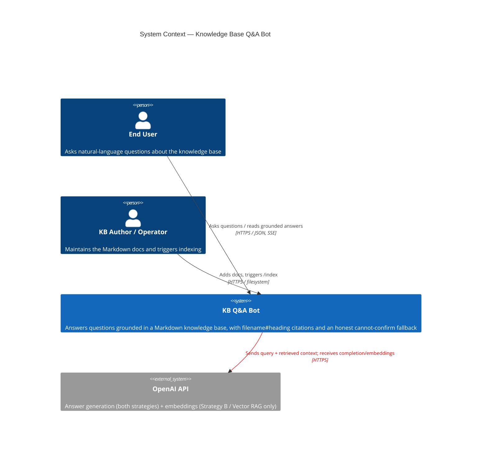
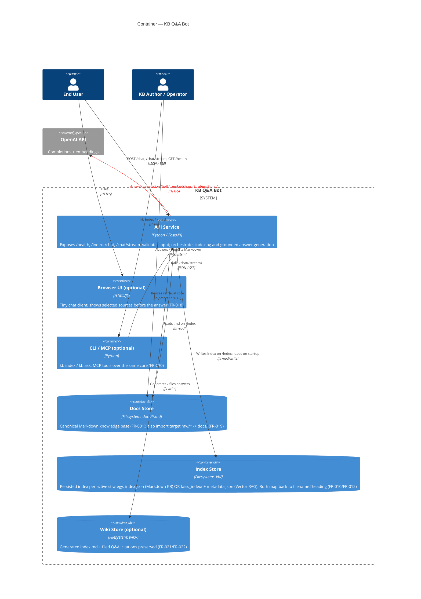

# Architecture Plan — Knowledge Base Q&A Bot

> Source of truth: `requirements.analysis.md` (NFRs) and `requirements.raw.md` (FRs) · 2026-05-29
> Notation: [C4 model](https://c4model.com/) — System Context, Container, Component. Diagrams use Mermaid C4.

## 1. Architectural Drivers

The structure below is shaped by the four recommended priorities in `requirements.analysis.md`:

1. **Grounding + citation correctness** (FR-004/FR-005) with cannot-confirm fallback (FR-006) → a single, shared retrieval+citation core that no interface can bypass.
2. **Reliability of the OpenAI dependency** (cross-cutting Availability) → all external calls isolated behind one LLM client with timeouts and graceful degradation.
3. **Input validation & key protection** (cross-cutting Security) → validation at the API edge; `OPENAI_API_KEY` stays server-side only.
4. **Index persistence + clean startup + observability** (FR-010/FR-012/FR-013) → an inspectable `.kb/` artifact loaded at startup, behind a persistence boundary.

Two further constraints are structural, not incidental:

- **Both retrieval strategies are first-class and selectable** behind one `RetrievalStrategy` interface, chosen at startup by config (`KB_STRATEGY=markdown_kb | vector_rag`):
  - **Strategy A — Markdown KB:** BM25 keyword search over heading sections; persists an inspectable `.kb/index.json`; **no embeddings** (OpenAI used only for the final answer).
  - **Strategy B — Vector RAG:** OpenAI embeddings + FAISS ANN search; persists `.kb/faiss_index/` + `metadata.json`; embeddings (FR-015) are a core runtime concern (OpenAI called at both `/index` and every `/chat`).

  Swapping strategy changes neither the `/chat` contract nor any route (cross-cutting Maintainability). The Embedding Service and FAISS index are **conditional on Strategy B**; everything else (routing, validation, citation, answer generation, persistence boundary) is strategy-agnostic.
- **Multiple interfaces** (HTTP, optional CLI/MCP/Web UI per FR-018/FR-020) must all call the **same retrieval core**, not forks.

---

## 2. Level 1 — System Context

**Notes**
- The red link to OpenAI is the system's only hard external dependency and the dominant reliability/cost/privacy risk (cross-cutting Availability, Compliance & Privacy). Queries leave the local boundary → third-party processing must be disclosed.
- The system trust boundary owns the `OPENAI_API_KEY`; it is never exposed to `user` or any client interface (FR-018/FR-020 Security).

---

## 3. Level 2 — Container

**Container responsibilities & key NFRs**

| Container | Responsibility | Driving requirements |
|---|---|---|
| API Service | Single backend; input validation, orchestration, all OpenAI calls | FR-002/003/008/017, Security, Availability |
| Docs Store (`docs/*.md`) | Canonical Markdown corpus + import landing zone | FR-001, FR-019 (Markdown is canonical) |
| Index Store (`.kb/`) | Persisted index for the active strategy (`index.json` or `faiss_index/` + `metadata.json`); survives restart | FR-010/012/013 (load on startup; artifact human-readable) |
| Wiki Store (`wiki/`) | Derived, deterministic browse/answer-filing artifacts | FR-021/022 (optional) |
| Browser UI / CLI / MCP | Thin clients over the shared core; show sources first | FR-018/020 (no key client-side) |

---

## 4. Level 3 — Component (API Service internals)

```mermaid
C4Component
    title Component — API Service

    System_Ext(openai, "OpenAI API", "Completions (both) + embeddings (Strategy B)")
    ContainerDb(docs, "Docs Store", "docs/*.md")
    ContainerDb(kb, "Index Store", ".kb/")

    Container_Boundary(api, "API Service") {
        Component(routes, "HTTP Router", "FastAPI routes", "/health, /index, /chat, /chat/stream")
        Component(validator, "Request Validator", "Pydantic schemas", "Rejects non-JSON/missing query/oversized payloads with 4xx (Security)")
        Component(indexer, "Indexer", "module", "Parses docs into heading sections; chunks long sections; returns files_indexed/sections_indexed")
        Component(selector, "Strategy Selector", "factory + config", "Picks active RetrievalStrategy at startup from KB_STRATEGY")
        Component(retrieval, "Retrieval Core (interface)", "RetrievalStrategy", "index(sections)->stats; retrieve(query)->[(chunk,score)]; apply score threshold")
        Component(stratA, "Markdown KB Strategy", "BM25", "Keyword search over section index; persists/loads .kb/index.json; no embeddings")
        Component(stratB, "Vector RAG Strategy", "FAISS + embeddings", "ANN search over .kb/faiss_index/; uses Embedding Service")
        Component(embedder, "Embedding Service", "module (Strategy B only)", "Batch-embeds chunks at /index, embeds query at /chat; persists vectors (FR-015 Cost)")
        Component(persistence, "Index Persistence", "module", "Writes/loads .kb/ (index.json OR faiss_index/+metadata.json); rebuild-on-corrupt; load on startup")
        Component(citation, "Citation Formatter", "module", "Builds & validates filename#heading from chunk metadata; no fabricated citations")
        Component(answerer, "Answer Generator", "module", "Assembles grounded prompt; enforces cannot-confirm; streams tokens")
        Component(llm, "LLM Client", "OpenAI SDK wrapper", "Completions + embeddings; timeouts, retries, graceful degradation; holds API key")
        Component(obs, "Observability", "logging", "Structured logs: endpoint, latency, status, retrieval scores")
    }

    Rel(routes, validator, "Validates body")
    Rel(routes, indexer, "POST /index")
    Rel(routes, answerer, "POST /chat(/stream)")
    Rel(routes, obs, "Emits request logs")

    Rel(selector, retrieval, "Binds active strategy")
    Rel(retrieval, stratA, "impl A (KB_STRATEGY=markdown_kb)")
    Rel(retrieval, stratB, "impl B (KB_STRATEGY=vector_rag)")

    Rel(indexer, docs, "Reads .md", "fs")
    Rel(indexer, retrieval, "Build index via active strategy")
    Rel(stratB, embedder, "Embed chunks / query")
    Rel(indexer, persistence, "Persist index")
    Rel(persistence, kb, "Read/write", "fs")
    Rel(persistence, retrieval, "Loads index on startup")

    Rel(answerer, retrieval, "Retrieve top-k + scores")
    Rel(answerer, citation, "Format/validate sources")
    Rel(answerer, llm, "Generate / stream answer")
    Rel(embedder, llm, "Embedding calls")
    Rel(llm, openai, "HTTPS")

    UpdateRelStyle(embedder, llm, $textColor="red", $lineColor="red")
    UpdateRelStyle(llm, openai, $textColor="red", $lineColor="red")
```

**Component contracts (the load-bearing seams)**

- **Retrieval Core interface** — the keystone of the dual-strategy design: `index(sections) -> stats` and `retrieve(query) -> [(chunk, score)]`. **Two interchangeable implementations**, both returning the same `(chunk, score)` shape so every downstream component is strategy-agnostic:
  - *Markdown KB (A):* BM25 over heading sections; scores are keyword-relevance; persists `.kb/index.json`; no OpenAI embedding calls.
  - *Vector RAG (B):* embed query → FAISS ANN search; scores are cosine/L2 similarity; persists `.kb/faiss_index/` + `metadata.json`.
  Swapping changes no route and no `/chat` response shape (Maintainability NFR). Note the two score scales differ — the threshold (FR-016) is **per-strategy configurable**.
- **Strategy Selector** — a small factory that reads `KB_STRATEGY` at startup and binds one implementation to the Retrieval Core. The only component aware of which strategy is active; nothing else branches on it.
- **Embedding Service** — *used only when Strategy B is active.* Makes Vector RAG affordable: it **batches** chunk embeddings at `/index` and persists them in the FAISS index, so at chat time only the single query is embedded (FR-015 Cost — "embeddings cached/persisted; only query embedded at chat time"). Under Strategy A this component is inert and OpenAI is touched only for the final answer.
- **Citation Formatter** — the *single* place `filename#heading` is built, resolved from each retrieved chunk's metadata (`.kb/index.json` section record or `metadata.json` vector entry), and checked against the live index. Used by both `/chat` and `/chat/stream` so citations are identical across paths and strategies (FR-005 — no fabricated citations).
- **Answer Generator** — owns the grounding rule independent of strategy: it applies the configured **score threshold** (FR-016 — guards weak BM25 matches *and* semantic false positives) and emits the honest *cannot-confirm* response when the best score is below the floor or the KB is unindexed (FR-006/FR-007). Memory (FR-022) may inform the query but never overrides retrieved chunks.
- **LLM Client** — the only component that touches OpenAI and the only holder of `OPENAI_API_KEY`. Centralizes timeout (≤30s), retry, and graceful-degradation behavior for completions (both strategies) and embeddings (Strategy B), so a single failure path covers every endpoint (Availability NFR).

---

## 5. Key Runtime Flows

**`POST /index`** (FR-002): Router → Validator → Indexer reads `docs/*.md` → splits into heading sections (chunks long ones) → active strategy builds its index → Persistence writes `.kb/` → returns `{files_indexed, sections_indexed}`; Observability logs counts + duration.
- *Strategy A:* build BM25 section index → write `.kb/index.json`.
- *Strategy B:* Embedding Service batch-embeds chunks → build FAISS index → write `.kb/faiss_index/` + `metadata.json`.

**`POST /chat`** (FR-003): Router → Validator → Answer Generator → Retrieval Core `retrieve(query)` (Strategy A: BM25 search; Strategy B: embed query → FAISS ANN) → apply score threshold →
- *below threshold / not indexed* → cannot-confirm response, no citation;
- *above threshold* → Citation Formatter resolves sources from chunk metadata → LLM Client generates grounded answer → response = `{answer, sources[]}`.

**`POST /chat/stream`** (FR-017): same path, but Sources event is emitted **first**, then answer tokens, then a `done` event; grounding/citations identical to `/chat`.

**Startup** (FR-013): Strategy Selector binds the active strategy; Persistence loads its `.kb/` artifact (`index.json` or `faiss_index/` + `metadata.json`); corrupt/absent index degrades to a "needs indexing" state rather than crashing.

---

## 6. Architectural Decisions (ADR-style)

| # | Decision | Rationale (NFR) | Trade-off |
|---|---|---|---|
| AD-1 | Single backend container (modular monolith), strategies/interfaces as components | Smallest dependency surface; easy debugging at sample scale | Not horizontally partitioned — revisit at the 100k-file jump |
| AD-2 | **Both strategies first-class behind one `RetrievalStrategy` interface**, selected at startup via `KB_STRATEGY` | Lets the same system run BM25 (cheap, inspectable, zero-embedding) or Vector RAG (semantic recall over synonyms/paraphrases, Risk #2) with no `/chat` contract change (Maintainability) | Two code paths to test/maintain; differing score scales force a per-strategy threshold |
| AD-3 | Shared Citation Formatter + Answer Generator across all interfaces/endpoints **and both strategies** | No fabricated/divergent citations; grounding can't be bypassed (FR-004/005) | Components must consume the common `(chunk, score)` shape, not strategy internals |
| AD-4 | All OpenAI access (completions for both; embeddings for B) via one LLM Client with timeout/retry/degradation | Isolates the hard external dependency (Availability, Cost) | Single chokepoint must be well-tested |
| AD-4b | *(Strategy B)* Index-time embeddings batched + persisted in FAISS; only the query embedded per chat | Bounds embedding cost/latency (FR-015 Cost/Performance) | Re-index cost concentrated at `/index`; stale embeddings on model change |
| AD-5 | Persisted, inspectable index per strategy (`.kb/index.json` or `.kb/faiss_index/` + `metadata.json`) loaded on startup | Persistence + debuggability (FR-010/012/013) | Single-file/in-process index won't scale to 100k files (see §7) |
| AD-6 | `OPENAI_API_KEY` from env, server-side only, never logged/returned | Key is the most sensitive secret (CON-001, Security) | Clients cannot call OpenAI directly |

---

## 7. Scaling Path (10 → 100,000 files)

Per `requirements.analysis.md` Risk #5 and Design Question 8, the §3 container layout evolves rather than being rebuilt:

- **Index Store** → neither single-file artifact holds 100k files well: Strategy A's `index.json` + in-memory BM25 and Strategy B's single FAISS file both break down. Move to an external search engine (A) or a **managed/distributed vector DB / sharded FAISS** (B), and add **incremental indexing** (re-index/re-embed changed files only) instead of full rebuilds.
- **Retrieval Core** → the dual-strategy interface (AD-2) naturally extends to a **third hybrid strategy**: BM25 + vector with a re-ranking stage, combining A's precision and B's recall to curb semantic false positives at scale — added without route changes.
- **Embedding Service** → batching and a dimension/model registry become essential; an embedding-model change forces a full re-index, so version the index against the model.
- **API Service** → split the Indexer/Embedder into an async/worker container so `/chat` stays available during long re-index + re-embed runs (FR-002 Availability — last-good index or 503).
- **Cross-cutting** → embedding spend, vector memory footprint, ANN recall/latency tuning, concurrency during re-index, and freshness/invalidation become first-class; heading slugs must be unique across the corpus to keep citations valid.

---

## 8. Traceability (FR/NFR → element)

| Requirement | Realized by |
|---|---|
| FR-001/009/011 Indexing | Indexer + Docs Store |
| FR-002 `/index` | Router + Indexer + Persistence |
| FR-003/014 `/chat` + LLM | Router → Answer Generator → LLM Client |
| FR-004/005 Grounding & citation | Retrieval Core (both strategies) + Citation Formatter |
| FR-006/016 Cannot-confirm & threshold | Answer Generator (per-strategy threshold check) |
| FR-007 Chat before index | Answer Generator + Persistence state |
| FR-008 `/health` | Router (no OpenAI dependency) |
| FR-010/012/013 Persistence & startup | Index Persistence + Index Store (`.kb/index.json` or `.kb/faiss_index/`) |
| FR-015 Embeddings (Strategy B) | Embedding Service + Vector RAG Strategy + LLM Client |
| FR-017 Streaming | Router (`/chat/stream`) + Answer Generator |
| FR-018/020 UI/CLI/MCP | Client containers over shared core |
| FR-019 Multi-format import | Indexer pre-step into Docs Store |
| FR-021/022 Wiki & memory | Wiki Store + Answer Generator (memory ≠ override) |
| Security (key/input) | Validator + LLM Client (key custody) |
| Availability (OpenAI down) | LLM Client degradation + `/health` independence |
| Observability | Observability component (structured logs) |
| Maintainability (strategy swap) | `RetrievalStrategy` interface + Strategy Selector (`KB_STRATEGY`) |
