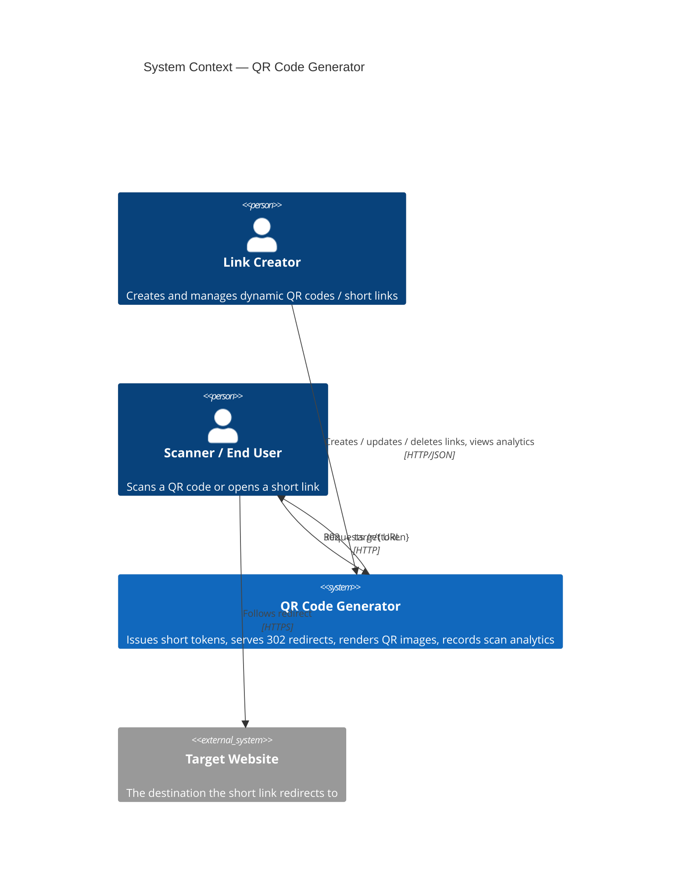
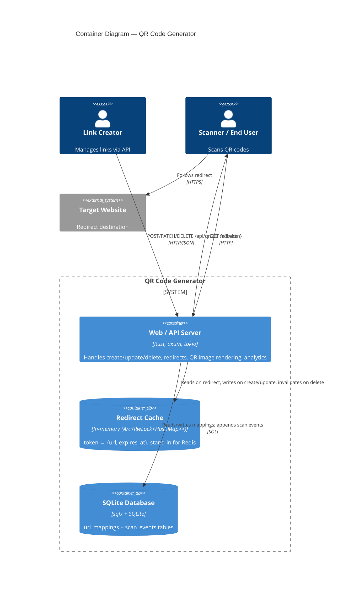
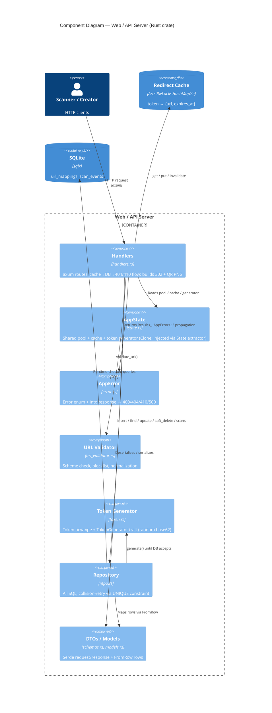
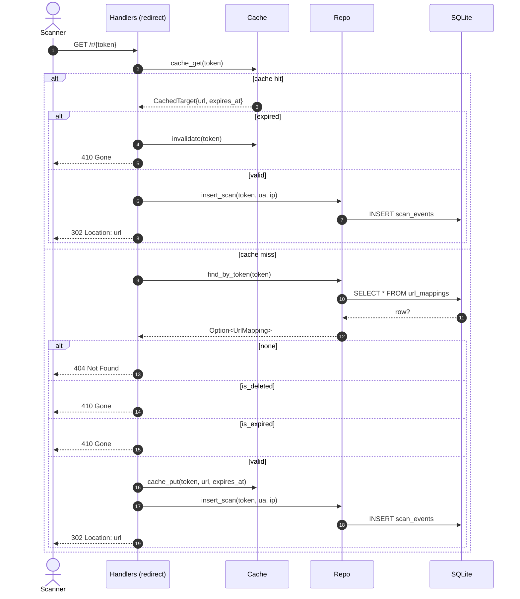
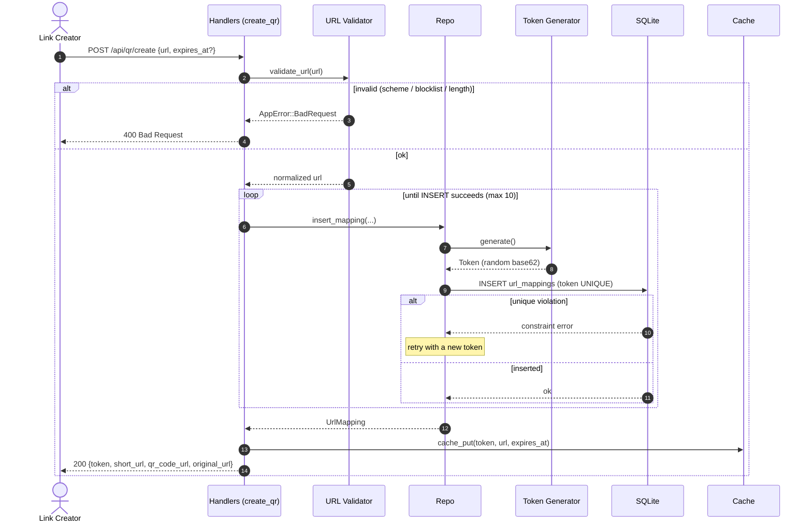

# Architecture — QR Code Generator (Rust)

C4 model diagrams for the dynamic QR-code / URL-shortener service. The boxes in the
Component diagram map 1:1 to the modules in [`../src/`](../src/).

---

## Level 1 — System Context

---

## Level 2 — Containers

---

## Level 3 — Components (inside the Web / API Server)

---

## Level 4 — Dynamics: the redirect request (`GET /r/{token}`)

The hot path. Cache hit serves a 302 without touching SQLite; on a miss the DB
decides between 302 / 404 / 410.

---

## Level 4 — Dynamics: create a link (`POST /api/qr/create`)

Shows the token collision-retry loop driven by the DB's UNIQUE constraint.

---

### Notes
- Mermaid's C4 support is experimental; `UpdateLayoutConfig` tunes shapes-per-row if a
  diagram looks cramped. Sequence diagrams render cleanly everywhere.
- Renders on GitHub, in VS Code (Markdown preview), and at mermaid.live.
